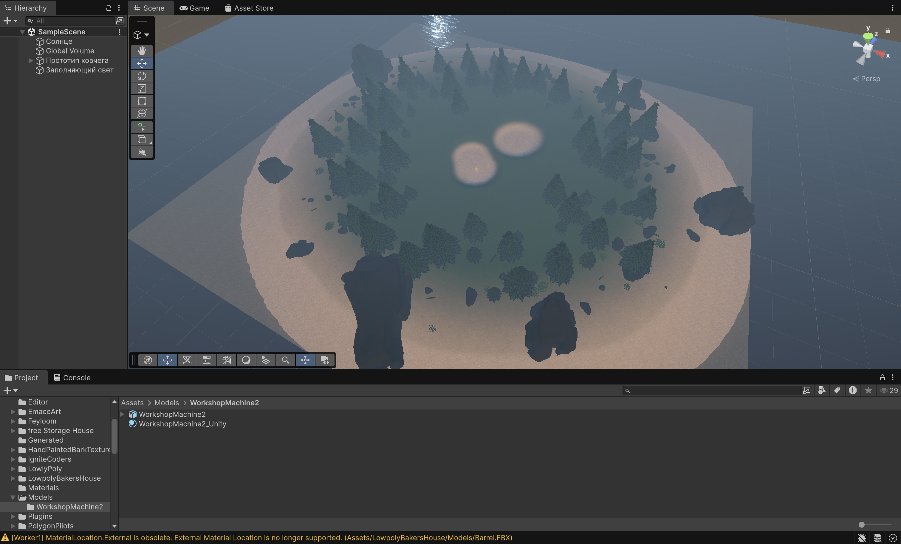

# Ковчег

Сделано Юнусов Р.К. М8О-410Б-22

Небольшой 3D survival-builder про строительство корабля на острове перед потопом.

Игрок рубит деревья топором, собирает брёвна, строит постройки и постепенно подготавливает корабль. Вода окружает остров, поэтому основная цель — успеть построить причал и корабль, а затем уплыть.

## Механики

- деревья имеют запас прочности и дают брёвна после разрушения;
- брёвна можно носить в руках или складывать на склад;
- доступны постройки: костёр, склад, лесопилка, дом лесника, причал и корабль;
- лесопилка перерабатывает брёвна в доски;
- дом лесника выпускает собаку, которая сама ищет деревья, рубит их и относит брёвна на склад;
- корабль строится после причала и требует доски;
- после постройки корабля можно подняться на него и уплыть.

## Управление

- `WASD` — движение;
- `Shift` — бег;
- мышь — обзор;
- `ЛКМ` — удар топором;
- `E` — взаимодействие;
- `B` — меню строительства;
- `Tab` — статистика;
- `Esc` — меню.
